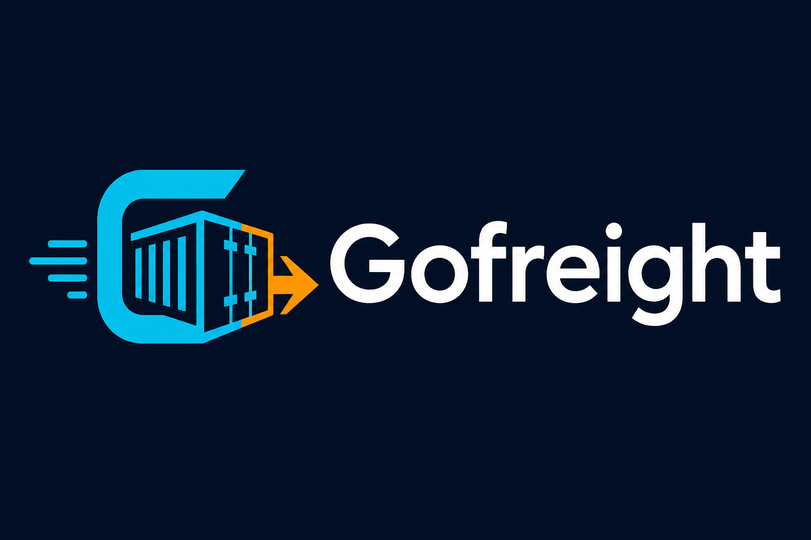

  

<h1 align="center">Gofreight Documentation</h1>

  Batteries-included web framework for Go — compile to a single binary.

  <strong>Framework repo:</strong> <a href="https://github.com/lsgser/gofreight">github.com/lsgser/gofreight</a>
  · <strong>Docs site:</strong> <a href="https://lsgser.github.io/gofreight-web/">lsgser.github.io/gofreight-web</a>

---

## Start here

| Guide | Description |
|-------|-------------|
| [Getting Started](getting-started.md) | Install CLI, create an app, first routes |
| [Features overview](features.md) | Complete index of framework capabilities |
| [CLI commands](commands.md) | Every `gofreight` command with examples |
| [Changelog](changelog.md) | Release history and unreleased features |

---

## Prologue

| Guide | Description |
|-------|-------------|
| [Project structure](project-structure.md) | Framework vs application layout |
| [Configuration](configuration.md) | Environment variables and YAML config |
| [Application wiring](application-wiring.md) | Bootstrap helpers and driver setup |

---

## The Basics

| Guide | Description |
|-------|-------------|
| [Routing](routing.md) | Groups, constraints, binding, signed URLs, files |
| [Controllers](controllers.md) | Status codes, redirects, uploads, JSON/HTML |
| [Middleware](middleware.md) | HTTP pipeline, CSRF, CORS, rate limiting |
| [Error handling](error-handling.md) | Panic recovery and error pages |
| [ORM](orm.md) | Models, queries, associations, validations |
| [Database](database.md) | Migrations, seeding, blueprint DSL |
| [Templating (GFT)](templating.md) | Gofreight Templates syntax and Vite |
| [Forms & validation](forms-validation.md) | Vine schemas and GFT form components |

---

## Digging Deeper

| Guide | Description |
|-------|-------------|
| [Authentication](authentication.md) | Session login, JWT, API tokens, OAuth |
| [Authorization](authorization.md) | Policies, gates, and roles |
| [Sessions](sessions.md) | File/Redis sessions, flash, CSRF |
| [Mail](mail.md) | Mailables, SMTP, queued delivery |
| [Jobs & Queues](jobs.md) | Background jobs, Redis workers, named jobs |
| [Scheduling](scheduling.md) | Cron-style task scheduler |
| [Notifications](notifications.md) | Mail + database notifications |
| [Cache](cache.md) | Memory, file, Redis, HTTP caching |
| [Storage](storage.md) | Local disk, uploads, downloads |
| [Services & Container](services.md) | Business logic and dependency injection |
| [API Resources](api-resources.md) | JSON serializers for API responses |
| [Real-time WebSockets](realtime.md) | Rooms, events, Redis broadcast |
| [GraphQL](graphql.md) | SDL schemas, DataLoader, playground |
| [Localization](localization.md) | i18n and translation files |

---

## Advanced

| Guide | Description |
|-------|-------------|
| [Security](security.md) | CSRF, headers, rate limiting, production |
| [Testing](testing.md) | gftest, factories, BDD-style tests |
| [Date & time](datetime.md) | Fluent date helpers |
| [Integrations](integrations.md) | Mail, cache, storage drivers |
| [Plugins](plugins.md) | Lifecycle hooks and extensions |
| [Extending Gofreight](extending.md) | Custom integrations and events |
| [Admin dashboard](admin.md) | Development database admin |
| [Deployment](deployment.md) | Docker, systemd, production checklist |
| [Generators](generators.md) | `make:*` scaffolds and field types |

---

## Tutorials

Step-by-step guides from zero to production features:

| Tutorial | Description |
|----------|-------------|
| [Your First App](tutorial-first-app.md) | Create and run a project from scratch |
| [Build a REST API](tutorial-rest-api.md) | Route groups, JSON, ApiResource |
| [HTML CRUD with GFT](tutorial-html-crud.md) | Templates, forms, validation |
| [JWT Authentication](tutorial-auth-jwt.md) | Protected API routes |
| [Real-time WebSockets](tutorial-realtime.md) | Live chat with rooms and events |
| [GraphQL API](tutorial-graphql.md) | SDL, resolvers, DataLoader |

---

## Quick links

- [Example blog app](https://github.com/lsgser/gofreight/tree/main/examples/blog)
- [Framework README](https://github.com/lsgser/gofreight/blob/main/README.md)
- Admin panel (dev): `http://localhost:5000/admin`
